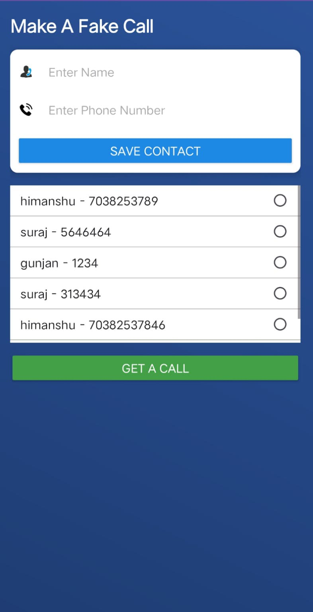
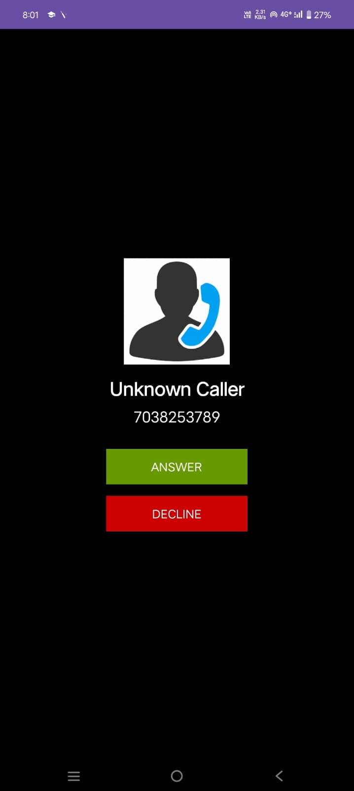

# 📱 Fake Call App 

🚀 **Fake Call App** is an Android application that allows users to create and manage fake contacts, select a specific number, and initiate a fake incoming call. The app displays a realistic call screen with **Answer** and **Reject** buttons. When answered, a pre-recorded voice message is played.  

> 🎯 **Use Case:** This app can be a useful tool in women’s safety applications, helping women escape uncomfortable situations by simulating a fake call.

---

## ✨ Features

✅ **Save Fake Contacts:** Users can store fake contact details (Name & Number).  
✅ **Select a Contact:** Choose a saved contact for a fake incoming call.  
✅ **Realistic Call Screen:** Simulates an actual incoming call interface.  
✅ **Answer or Reject Call:** Users can either accept or decline the call.  
✅ **Play Voice Message:** On answering, a pre-recorded voice message is played.  
✅ **Women Safety Use Case:** Acts as a discreet escape tool in unsafe situations.  

---

## 📷 Screenshots

| Fake Contacts List | Fake Incoming Call | 
|-------------------|-------------------|
|  |  | 

---

## 📌 How It Works?

1️⃣ **Add Fake Contacts** – Users save contacts with fake names & numbers.  
2️⃣ **Select Contact** – Choose a contact for the fake call.  
3️⃣ **Initiate Fake Call** – A scheduled or instant fake call is triggered.  
4️⃣ **Receive Fake Call** – The call screen appears just like a real incoming call.  
5️⃣ **Answer or Reject** – If answered, a voice message is played.  

---

## 🛠 Tech Stack

- **Android Studio** - For development  
- **Kotlin/Java** - Programming Language  
- **XML** - UI Design  
- **MediaPlayer API** - Playing voice message  
- **Android Call UI** - For a realistic experience  

---

## 📲 Installation Guide

1️⃣ Clone this repository:
```bash
git clone https://github.com/your-username/fake-call-app.git
